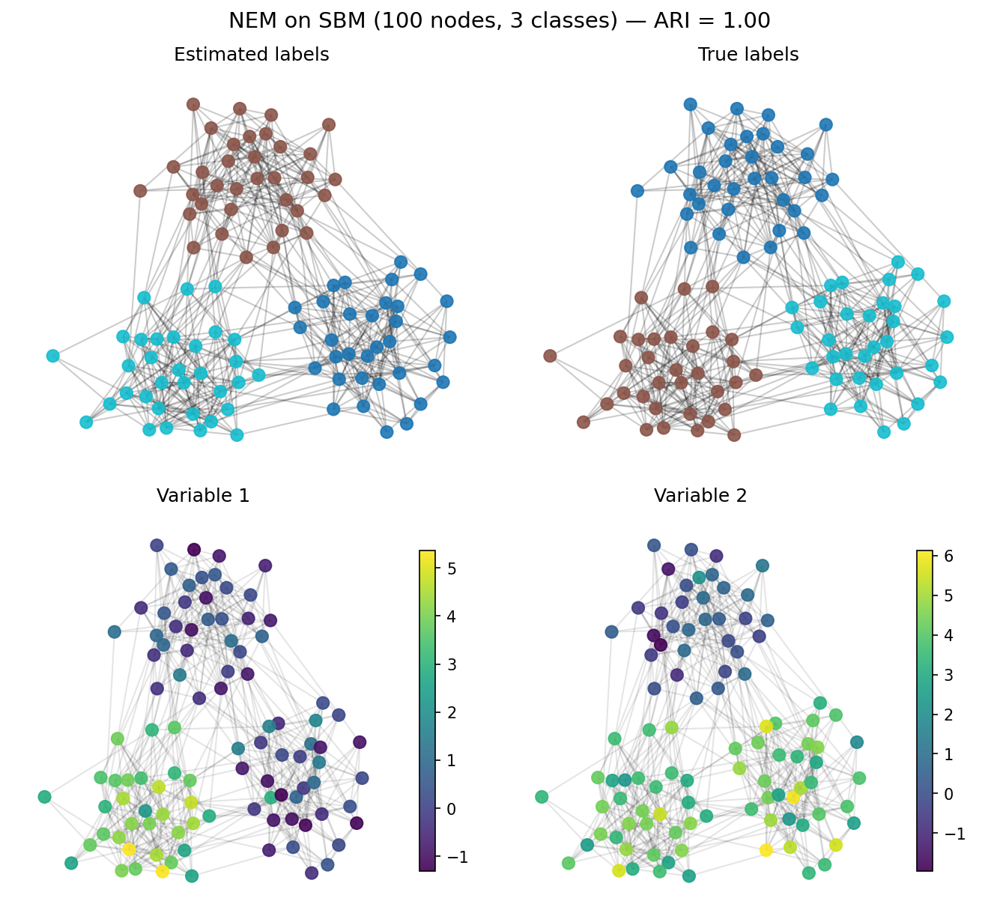
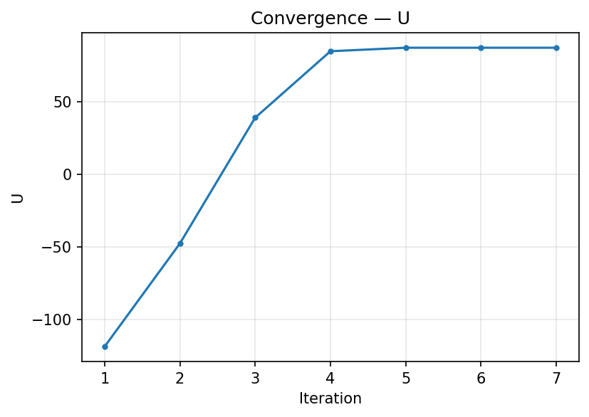
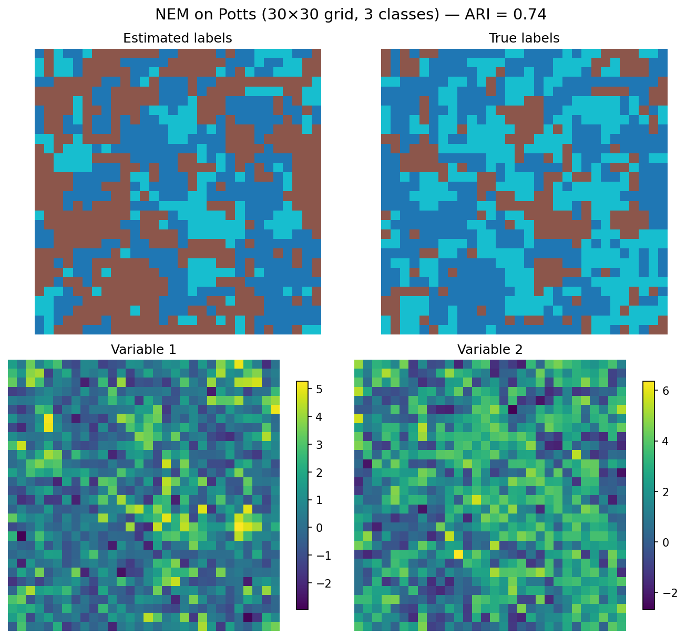
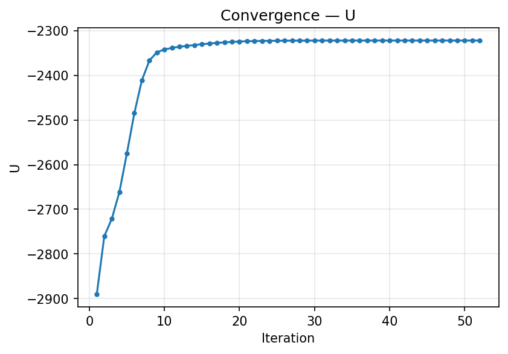

# NEM — Neighborhood EM for Spatial Clustering

NEM is a spatial clustering algorithm that combines the EM algorithm with
Hidden Markov Random Fields. Given a graph where each node carries a feature
vector, NEM produces a partition that accounts for both the data and the
spatial structure of the graph.

>The original C code  was written by Van Mo Dang in 1996 and the last C version dates from 1999 (v1.07). Claude-code has helped to reactivate the code and to provide a python version. 

**Reference:**
Ambroise, C., Dang, V.M. and Govaert, G. (1997). Clustering of spatial data
by the EM algorithm. *geoENV I — Geostatistics for Environmental Applications*,
Vol. 9, Kluwer Academic Publisher, pp. 493–504.

## Repository structure

```
NEM/
├── csrc/           # Original C implementation (v1.07)
├── pynem/          # Python reimplementation (standalone package)
│   ├── src/pynem/  # Package source
│   └── tests/      # Test suite
├── examples/       # Example data and synthetic generators
│   ├── generate.py           # SBMData, PottsImageData generators
│   ├── example_sbm_100.py    # SBM graph example (100 nodes, 2D)
│   ├── example_sbm_200.py    # SBM graph example (200 nodes, 2D)
│   ├── example_potts_30x30.py # Potts image example (30×30 grid, 2D)
│   └── essai.*               # Original dataset (100 nodes, 3 vars)
└── README.md
```

---

## Example: SBM graph with 100 nodes

This example generates a Stochastic Block Model graph with 100 nodes,
3 classes, and 2-dimensional Gaussian emissions, then clusters it with NEM.

### Generate synthetic data

```python
from generate import SBMData

sbm = SBMData(
    n=100, k=3, d=2,
    p_in=0.2, p_out=0.02,
    centers=[[0, 0], [3, 3], [0, 3]],
    sigma=1.0, seed=42,
)
sbm.export("sbm_100_2")   # writes .str, .dat, .nei, .true.cf
```

### Run NEM and evaluate

```python
import pynem

G = pynem.io.read_graph("examples/sbm_100_2")
model = pynem.NEM(n_clusters=3, beta=1.0, family="normal")
model.fit(G)

# Adjusted Rand Index (requires true labels)
true_labels = sbm.labels + 1  # convert to 1-based
ari = pynem.metrics.adjusted_rand_index(true_labels, model.labels_)
print(f"Adjusted Rand Index: {ari:.4f}")
# Adjusted Rand Index: 0.9403
```

### Visualize results

```python
fig = pynem.viz.plot_results(G, model, true_labels=true_labels,
                             var_names=["Variable 1", "Variable 2"])
```

The top row shows estimated vs true labels; the bottom row shows each
dimension of the emission vector on the graph:



Convergence of the NEM criterion U:



On this dataset NEM recovers the true partition with high accuracy
(ARI = 0.94) in 7 iterations.

---

## Example: Potts image with 30×30 grid

This example generates a Potts Markov Random Field on a 30×30 pixel grid with
3 classes and 2-dimensional Gaussian emissions, then clusters it with NEM.

### Generate synthetic data

```python
from generate import PottsImageData

potts = PottsImageData(
    nl=30, nc=30, k=3, beta=0.8,
    centers=[[0, 0], [3, 3], [0, 3]],
    sigma=1.0, seed=42,
)
potts.export("potts_30x30_3")   # writes .str, .dat, .nei, .true.cf
```

### Run NEM and evaluate

```python
import pynem

G = pynem.io.read_graph("examples/potts_30x30_3")
model = pynem.NEM(n_clusters=3, beta=1.0, family="normal")
model.fit(G)

# Adjusted Rand Index (requires true labels)
true_labels = potts.labels + 1  # convert to 1-based
ari = pynem.metrics.adjusted_rand_index(true_labels, model.labels_)
print(f"Adjusted Rand Index: {ari:.4f}")
# Adjusted Rand Index: 0.7379
```

### Visualize results

```python
fig = pynem.viz.plot_results(G, model, true_labels=true_labels,
                             var_names=["Variable 1", "Variable 2"])
```

The top row shows estimated vs true labels; the bottom row shows each
dimension of the emission vector as a pixel image:



Convergence of the NEM criterion U:



On this dataset NEM recovers the main spatial structure (ARI = 0.74),
the lower score compared to the SBM example reflecting the harder
segmentation task: the classes have overlapping emissions (σ = 1,
center gap = 3) and the Potts prior creates irregular, non-convex regions.

---

## pynem — Python package

`pynem` is a pure-Python reimplementation of the NEM algorithm, with a
scikit-learn-style API. It uses NetworkX for graph handling, NumPy/SciPy for
computation, and Matplotlib for visualization.

### Installation

```bash
cd pynem
pip install -e ".[dev]"
```

### Quick start

```python
import pynem

# Load data (reads .str, .dat, .nei files)
G = pynem.io.read_graph("examples/essai")

# Fit NEM with 3 clusters and spatial regularization
model = pynem.NEM(n_clusters=3, beta=1.0, family="normal")
model.fit(G)

# Results
model.labels_        # hard classification (N,)
model.membership_    # soft classification (N, K)
model.centers_       # cluster centers (K, D)
model.dispersions_   # cluster dispersions (K, D)
model.proportions_   # cluster proportions (K,)
model.criteria_      # dict with U, D, G, L, M values

# Visualization
fig = pynem.viz.plot_results(G, model)
pynem.viz.plot_convergence(model.history_)
```

### Evaluation with simulated data

When true labels are available (e.g. from `SBMData` or `PottsImageData`),
compute the Adjusted Rand Index to quantify clustering accuracy:

```python
ari = pynem.metrics.adjusted_rand_index(true_labels, model.labels_)
```

### Features

| Feature | Options |
|---|---|
| Algorithm | `nem` (mean field), `ncem` (ICM hard), `gem` (Gibbs) |
| Distributions | `normal`, `laplace`, `bernoulli` |
| Dispersion models | `s__` (shared), `sk_` (per-class), `s_d` (per-variable), `skd` (full) |
| Proportions | `p_` (equal), `pk` (free) |
| Beta estimation | `fix`, `psgrad` (pseudo-gradient), `heu_d`, `heu_l` (heuristics) |
| Initialization | `sort`, `random` (with multiple starts) |
| Missing data | `replace` (EM-style) or `ignore` |

### API

The `NEM` class follows scikit-learn conventions:

```python
model = pynem.NEM(
    n_clusters=3,           # number of clusters K
    beta=1.0,               # spatial regularization (0 = standard EM)
    algorithm="nem",        # nem | ncem | gem
    family="normal",        # normal | laplace | bernoulli
    dispersion="s__",       # s__ | sk_ | s_d | skd
    proportion="pk",        # p_ | pk
    beta_mode="fix",        # fix | psgrad | heu_d | heu_l
    init="sort",            # sort | random
    n_init=1,               # random restarts (for init="random")
    max_iter=100,
    tol=1e-3,
    random_state=42,
)
model.fit(G)
```

### Visualization

- `pynem.viz.plot_results(G, model, true_labels=...)` — estimated labels, true labels, and per-dimension feature views
- `pynem.viz.plot_labels(G, labels)` — labels on graph or image
- `pynem.viz.plot_feature(G, values)` — continuous values on graph or image
- `pynem.viz.plot_convergence(history)` — criterion vs iteration
- `pynem.viz.plot_membership(G, membership)` — soft membership heatmap
- `pynem.viz.plot_cluster_centers(centers)` — parallel coordinates

### Criteria

- **U** = D + 0.5 * beta * G — NEM criterion (main objective)
- **D** — Hathaway discrepancy (data fit)
- **G** — geographic cohesion (spatial smoothness)
- **L** — mixture log-likelihood
- **M** — Markovian pseudo-likelihood

---

## C implementation

The original C code (v1.07, 1999) by Van Mo Dang.

### Building

```bash
cd csrc && make exe
```

Produces `nem_exe` and utilities (`geo2nei`, `randord`, `err2`, `tcpu`).

### Usage

```bash
csrc/nem_exe examples/essai 3              # 3 clusters, default settings
csrc/nem_exe examples/essai 3 -b 0         # pure EM (no spatial effect)
csrc/nem_exe examples/essai 3 -b 0.1       # moderate spatial smoothing
csrc/nem_exe examples/essai 3 -B heu_d     # automatic beta estimation
csrc/nem_exe examples/essai 3 -a ncem      # hard classification (ICM)
csrc/nem_exe examples/essai 3 -m norm pk sk_  # free proportions, per-class variance
```

### Input files

NEM expects files sharing the same base name:

| File | Format |
|---|---|
| `.str` | `S N D` or `N N D` (spatial/non-spatial) or `I Nl Nc D` (image grid) |
| `.dat` | N x D matrix of feature vectors (space-separated) |
| `.nei` | Adjacency list: first line = weighted flag, then `[NodeID] [NbNeighbors] [Neighbors...]` |


where 
- N is the sample size
- D is the number of features of each sample vector
- Nl is the number of lines of the image (if the imput data is an image)
- Nc is the number of columns of the image (if eh input data is an image)

### Output files

| File | Content |
|---|---|
| `.cf` | Hard classification (one label per node) |
| `.uf` | Fuzzy classification (K membership probabilities per node) |
| `.mf` | Model parameters (criteria, beta, centers, dispersions, proportions) |
| `.log` | Iteration log (with `-l y`) |

### Options

```bash
csrc/nem_exe -h options    # full option reference
```

| Option | Description |
|---|---|
| `-b <beta>` | Spatial strength (default 1.0, 0 = pure EM) |
| `-B <mode>` | Beta estimation: `fix`, `psgrad`, `heu_d`, `heu_l` |
| `-a <algo>` | Algorithm: `nem`, `ncem`, `gem` |
| `-m <fam> <prop> <disp>` | Model: family, proportions, dispersion |
| `-s <init> <param>` | Initialization: `s` (sort), `r` (random with N starts) |
| `-C <crit>` | Selection criterion: `U`, `M`, `D`, `L` |
| `-f fuzzy` | Output fuzzy membership |
| `-c <test> <thr>` | Convergence: `clas`, `crit`, `none` |
| `-i <max>` | Maximum iterations |
| `-l y` | Enable log file |

## License

MIT
